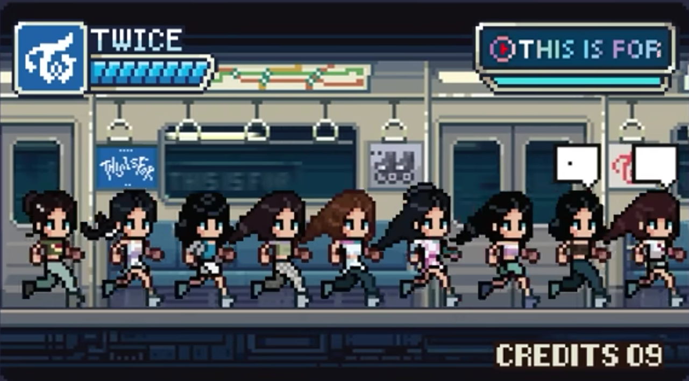

# K-Pop Lines Distribution [PRIORITY QUEUE]

In K-Pop, line distribution refers to how the singing and rapping sections of a song are divided among the members. Fans usually talk about it because it can reveal whether the sections are unevenly divided or bring out a member's skill.

Create a C++ program simulating K-Pop line distribution, using a priority queue like behavior. The member with the longer singing time are given higher priority in the output display. Here's how will it work:

1. Ask the user for input: Group Name, Track Title
2. Repeatedly ask the user to input the names of the members, including the number of seconds.
3. After each input, manually sort the members based on their seconds in descending order, where the longest singing time is ranked first.
4. The updated list will be displayed.
5. Ask the user if they still want to add a new member.
6. If they wish to not continue, ask the user if they want to enter a new group.
7. If yes, then Step 1. If no, then the program ends with a thank you message.

Note: Line Distribution Source: random_k and random_2 on YouTube.

## Sample Outputs
### Sample Output 1
```
~ annyeong!! ^^ ~

Enter group name: TWICE
Enter track title: THIS IS FOR

Enter TWICE member: NAYEON
Enter number of seconds: 28.47

TWICE's "THIS IS FOR" LINE DISTRIBUTION QUEUE
[1] NAYEON - 28.47s

Continue? (Y/N): Y

Enter TWICE member: JEONGYEON
Enter number of seconds: 17.26

TWICE's "THIS IS FOR" LINE DISTRIBUTION QUEUE
[1] NAYEON - 28.47s
[2] JEONGYEON - 17.26s

Continue? (Y/N): Y

Enter TWICE member: MOMO
Enter number of seconds: 15.74

TWICE's "THIS IS FOR" LINE DISTRIBUTION QUEUE
[1] NAYEON - 28.47s
[2] JEONGYEON - 17.26s
[3] MOMO - 15.74s

Continue? (Y/N): Y

Enter TWICE member: SANA
Enter number of seconds: 12.15

TWICE's "THIS IS FOR" LINE DISTRIBUTION QUEUE
[1] NAYEON - 28.47s
[2] JEONGYEON - 17.26s
[3] MOMO - 15.74s
[4] SANA - 12.15s

Continue? (Y/N): Y

Enter TWICE member: JIHYO
Enter number of seconds: 39.43

TWICE's "THIS IS FOR" LINE DISTRIBUTION QUEUE
[1] JIHYO - 39.43s
[2] NAYEON - 28.47s
[3] JEONGYEON - 17.26s
[4] MOMO - 15.74s
[5] SANA - 12.15s

Continue? (Y/N): Y

Enter TWICE member: MINA
Enter number of seconds: 15.67

TWICE's "THIS IS FOR" LINE DISTRIBUTION QUEUE
[1] JIHYO - 39.43s
[2] NAYEON - 28.47s
[3] JEONGYEON - 17.26s
[4] MOMO - 15.74s
[5] MINA - 15.67s
[6] SANA - 12.15s

Continue? (Y/N): Y

Enter TWICE member: DAHYUN
Enter number of seconds: 10.44

TWICE's "THIS IS FOR" LINE DISTRIBUTION QUEUE
[1] JIHYO - 39.43s
[2] NAYEON - 28.47s
[3] JEONGYEON - 17.26s
[4] MOMO - 15.74s
[5] MINA - 15.67s
[6] SANA - 12.15s
[7] DAHYUN - 10.44s

Continue? (Y/N): Y

Enter TWICE member: CHAEYOUNG
Enter number of seconds: 12.20

TWICE's "THIS IS FOR" LINE DISTRIBUTION QUEUE
[1] JIHYO - 39.43s
[2] NAYEON - 28.47s
[3] JEONGYEON - 17.26s
[4] MOMO - 15.74s
[5] MINA - 15.67s
[6] CHAEYOUNG - 12.20s
[7] SANA - 12.15s
[8] DAHYUN - 10.44s

Continue? (Y/N): Y

Enter TWICE member: TZUYU
Enter number of seconds: 12.32

TWICE's "THIS IS FOR" LINE DISTRIBUTION QUEUE
[1] JIHYO - 39.43s
[2] NAYEON - 28.47s
[3] JEONGYEON - 17.26s
[4] MOMO - 15.74s
[5] MINA - 15.67s
[6] TZUYU - 12.32s
[7] CHAEYOUNG - 12.20s
[8] SANA - 12.15s
[9] DAHYUN - 10.44s

Continue? (Y/N): N

New group? (Y/N): N

~ gamsahabnida!! ^^ ~
```
### Sample Output 2
```
~ annyeong!! ^^ ~

Enter group name: HUNTR/X
Enter track title: How It's Done

Enter HUNTR/X member: RUMI
Enter number of seconds: x
Invalid input. Please enter a numeric value: 61.54

HUNTR/X's "How It's Done" LINE DISTRIBUTION QUEUE
[1] RUMI - 61.54s

Continue? (Y/N): a
Invalid input. Please enter Y or N.

Continue? (Y/N): y

Enter HUNTR/X member: MIRA
Enter number of seconds: 36.15

HUNTR/X's "How It's Done" LINE DISTRIBUTION QUEUE
[1] RUMI - 61.54s
[2] MIRA - 36.15s

Continue? (Y/N): Y

Enter HUNTR/X member: ZOEY
Enter number of seconds: 36.83

HUNTR/X's "How It's Done" LINE DISTRIBUTION QUEUE
[1] RUMI - 61.54s
[2] ZOEY - 36.83s
[3] MIRA - 36.15s

Continue? (Y/N): x
Invalid input. Please enter Y or N.

Continue? (Y/N): N

New group? (Y/N): x
Invalid input. Please enter Y or N.

New group? (Y/N): N

~ gamsahabnida!! ^^ ~
```

### Sample Output 3
```
~ annyeong!! ^^ ~

Enter group name: SAJA BOYS
Enter track title: Soda Pop

Enter SAJA BOYS member: JINU
Enter number of seconds: 22.8

SAJA BOYS's "Soda Pop" LINE DISTRIBUTION QUEUE
[1] JINU - 22.80s

Continue? (Y/N): Y

Enter SAJA BOYS member: ABBY
Enter number of seconds: 13.8

SAJA BOYS's "Soda Pop" LINE DISTRIBUTION QUEUE
[1] JINU - 22.80s
[2] ABBY - 13.80s

Continue? (Y/N): Y

Enter SAJA BOYS member: ROMANCE
Enter number of seconds: 25.2

SAJA BOYS's "Soda Pop" LINE DISTRIBUTION QUEUE
[1] ROMANCE - 25.20s
[2] JINU - 22.80s
[3] ABBY - 13.80s

Continue? (Y/N): Y

Enter SAJA BOYS member: BABY
Enter number of seconds: 8.3

SAJA BOYS's "Soda Pop" LINE DISTRIBUTION QUEUE
[1] ROMANCE - 25.20s
[2] JINU - 22.80s
[3] ABBY - 13.80s
[4] BABY - 8.30s

Continue? (Y/N): Y

Enter SAJA BOYS member: MYSTERY
Enter number of seconds: 11.9

SAJA BOYS's "Soda Pop" LINE DISTRIBUTION QUEUE
[1] ROMANCE - 25.20s
[2] JINU - 22.80s
[3] ABBY - 13.80s
[4] MYSTERY - 11.90s
[5] BABY - 8.30s

Continue? (Y/N): N

New group? (Y/N): N

~ gamsahabnida!! ^^ ~
```