# CS 131 Assessments Submission
📂 Folder name: **LastNameFNMI_Section_CS131Activities**
<br>Example: **AgdonFMP_CS1304_CS131Activities**
<br>
💼 Pre-requisites:
<br>
✅ GitHub Account<br>
✅ Git Bash

## 🤔 Steps
Here's a quick guide on how to submit your assessment tasks.

### 🖥️ Install Git
1. Download and install from https://git-scm.com/
2. Configure your Git (first time only). Open Git Bash:
```bash
git config --global user.name "Your Name"
git config --global user.email "email@address.com"
```

### 😺 Create a GitHub Account
1. Go to https://github.com
2. Click Sign up and complete the registration.
3. Verify your email address.

### 🗃️ Uploading your files
1. Create a GitHub repository online
Go to https://github.com, click New repository.
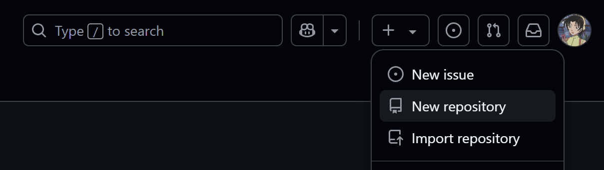

2. Apply the following settings:
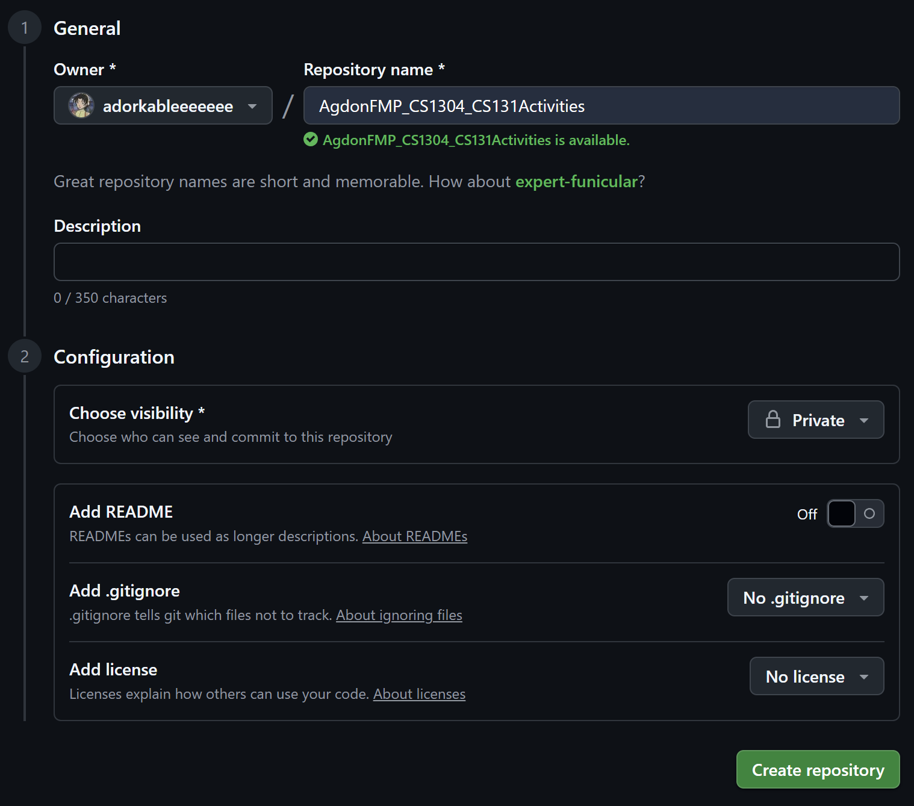
⚠️ **IMPORTANT!** Make sure that the repository is set to private.

3. Open Terminal (or Git Bash) and go to your project folder
    ```bash
    cd path/to/your/local/project
    ```
    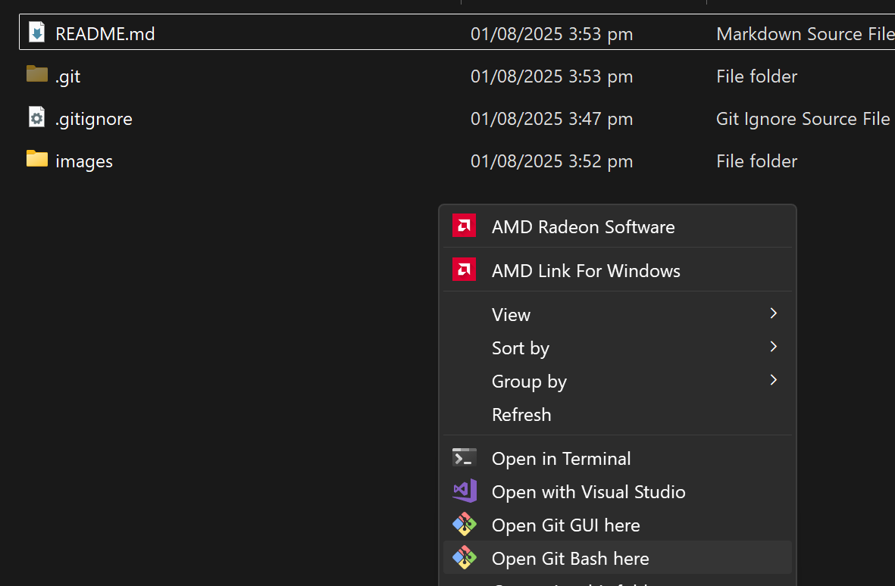

4. Initialize the local folder as a Git repository
    ```bash
    git init
    ```
    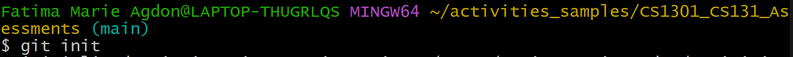

5. Add the remote repository URL
    ```bash
    git remote add origin https://github.com/<your-username>/<repo-name>.git
    ```
    Get the repository link here.
    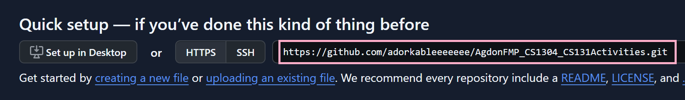
    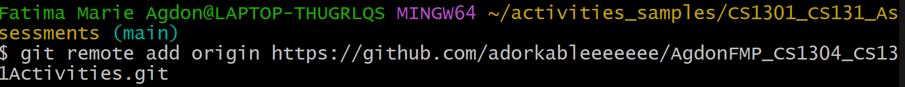

6. Add your local files
    ```bash
    git add .
    ```
    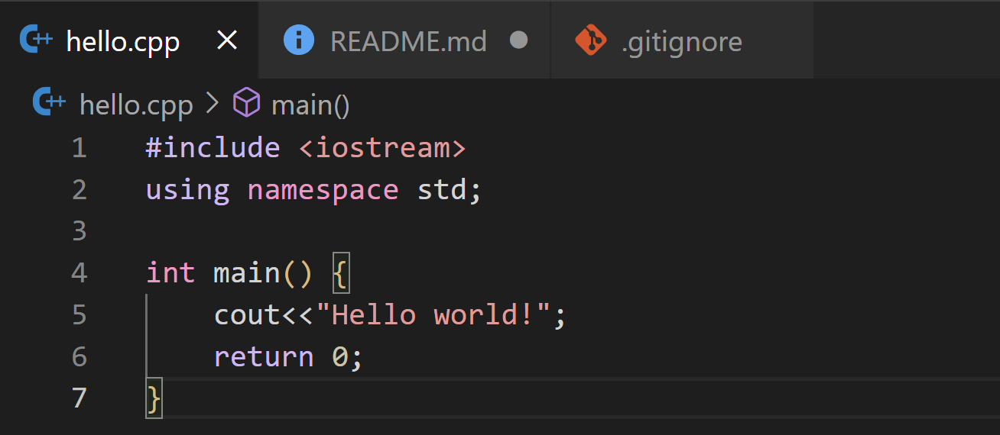
    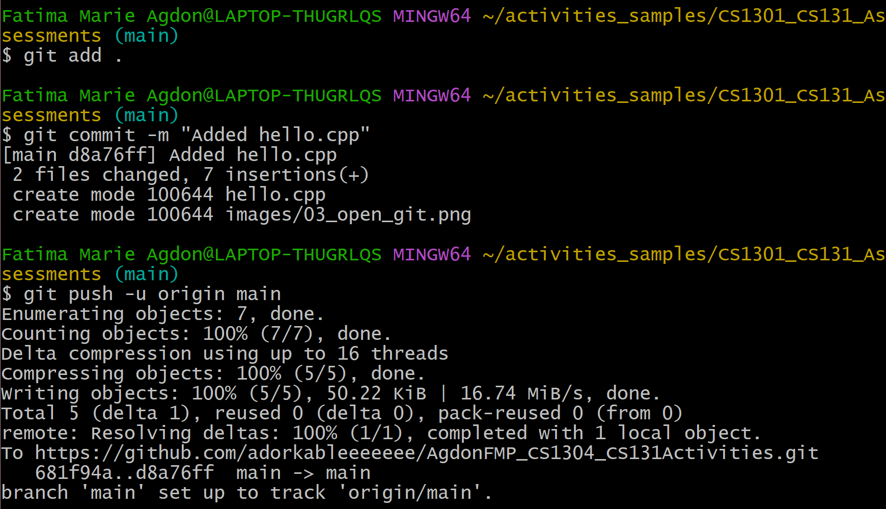

7. Commit your changes
    ```bash
    git commit -m "Initial commit"
    ```

8. Push to GitHub. If the GitHub repo is empty, push using:
    ```bash
    git push -u origin main
    ```
    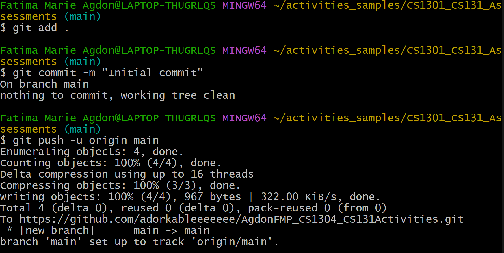

### 💞 Add me as a collaborator
To access your repository, make sure that I am added as a collaborator.
1. Open your GitHub Repository and click Settings.
    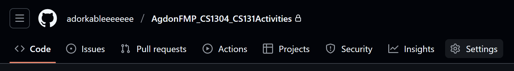
2. On the left side, click Collaborators.
    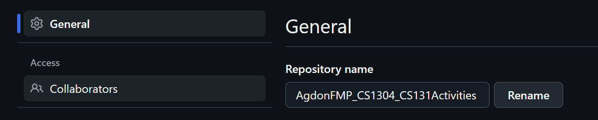
3. On Manage Access, click Add People. My username is: adorkableeeeeeee.
    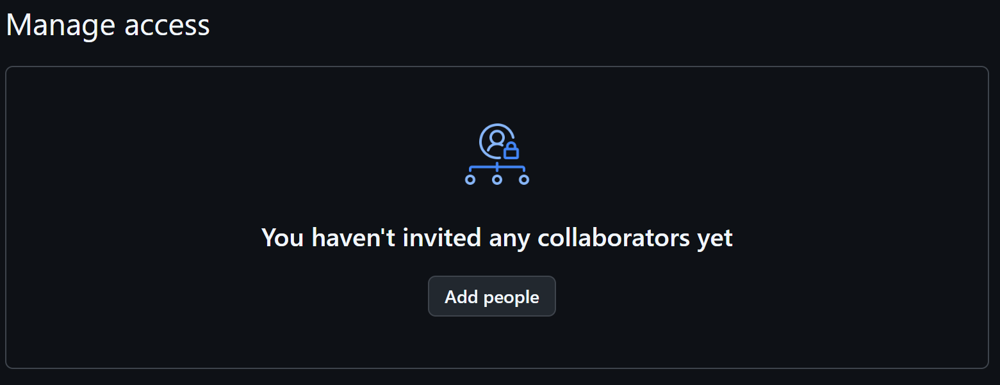
    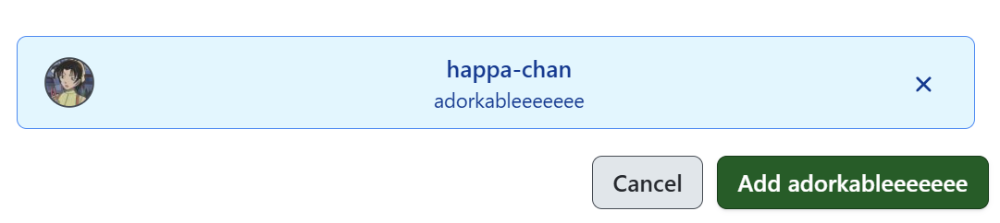
    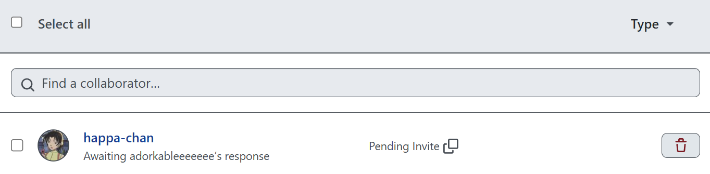
    Make sure to inform your instructor once I have been added. Broken links may be interpreted as *did not submit*, and a grade of INC.

### 🏷️ Naming Convention
Proper file naming convention must be observed. Folders must be named and structured properly. For example:
```
AgdonFMP_CS1304_CS131Activities/
├── Laboratory Activity 1/
│   ├── lab1_item1.cpp
|   ├── lab1_item2.cpp
│   └── lab1_item3.cpp
├── Laboratory Activity 2/
│   └── lab2.cpp
├── Laboratory Activity 3/
│   ├── lab3_item1.cpp
|   ├── lab3_item2.cpp
│   └── lab3_item3.cpp
└── README.md
```

### 💌 Submitting your links
Submit your links in this spreadsheet: [CS 131 - DSA Assessment Tasks](https://docs.google.com/spreadsheets/d/1GQvt-WVL9J6XRgwtogSUmxlcWvufSozOAB-nedM1MHg/edit?usp=sharing). Editing the spreadsheet will be disabled on **August 2, 2025, 3:00pm** 

***No link means no submission.***

PS: Follow me on GitHub: [marieemoiselle](https://github.com/marieemoiselle) ♡